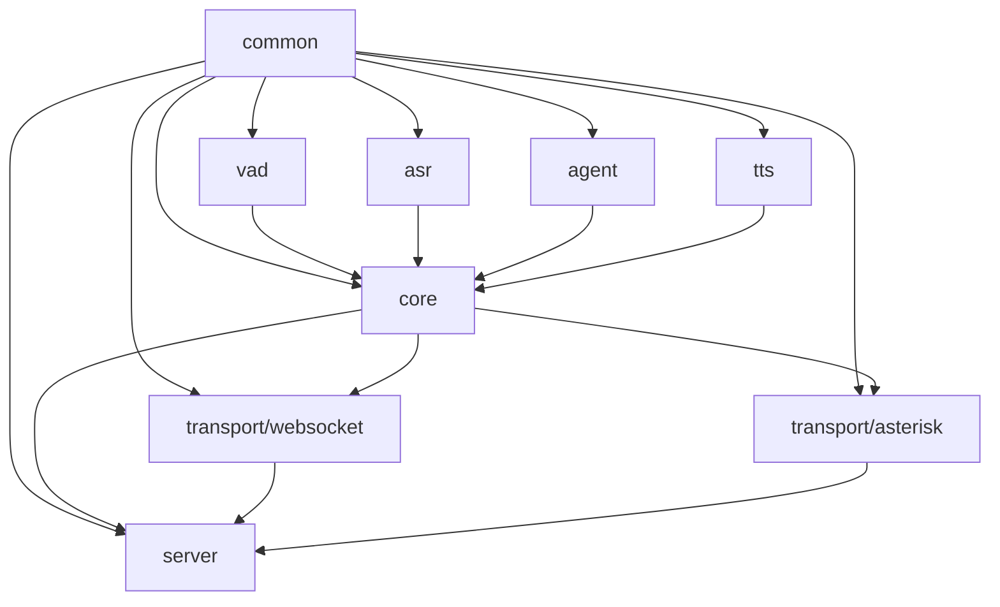
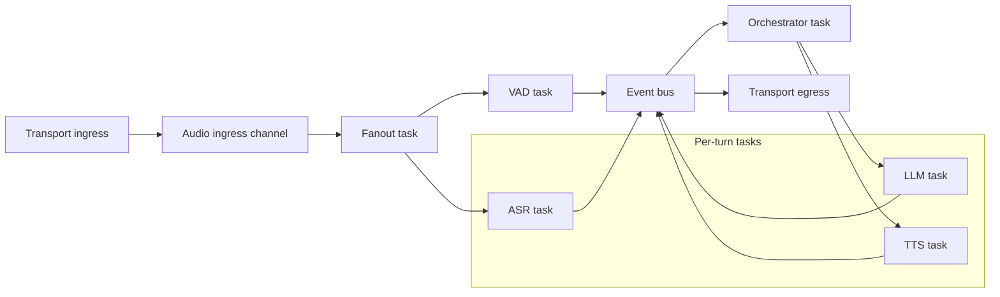
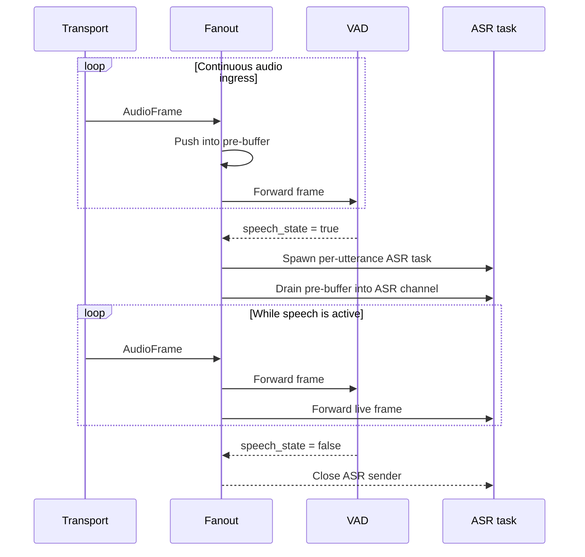
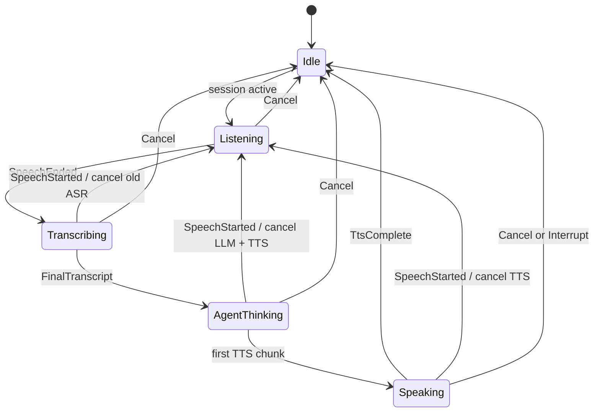
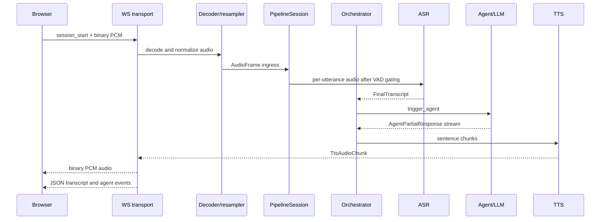
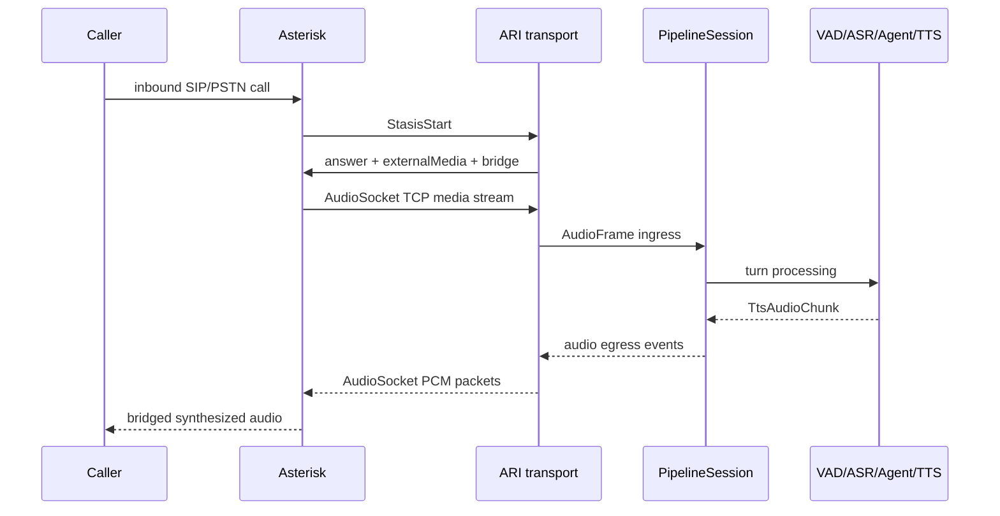
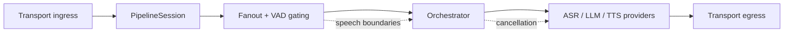

# Voicebot Architecture

This document explains the implemented architecture of the `voicebot` workspace for an intermediate Rust developer. The focus is the runtime logic behind the system: how audio enters the system, how turns are segmented, how ASR, the agent, and TTS are coordinated, and how the transport adapters stay decoupled from the core pipeline.

The codebase is built around one central idea:

> a voice session is a streaming, stateful, per-connection pipeline, not a request-response handler.

That design choice affects almost every subsystem. The code is organized so that transports only translate network or telephony I/O into canonical pipeline types, while the core crate owns turn-taking, cancellation, and downstream component orchestration.

## 1. System Goals And Constraints

The workspace is designed around a few hard constraints that matter when you read or modify the code:

- All internal audio is `AudioFrame`: 16 kHz, mono, signed 16-bit PCM.
- Sessions are isolated. Each call or WebSocket connection gets its own pipeline tasks and state.
- All channels are bounded. The system intentionally prefers bounded memory and explicit backpressure over unbounded buffering.
- The runtime is streaming-first. VAD, ASR, agent partials, and TTS chunks are all processed incrementally.
- The core pipeline must remain transport-agnostic. Telephony and WebSocket logic live outside `voicebot-core`.
- Cancellation is a first-class behavior. Barge-in is not a special case bolted on later; it is built into the session and orchestrator model.

This produces a pipeline that is simple to reason about locally: transports feed audio in, the core pipeline turns it into conversation state and audio out, and transports decide how to expose the output.

## 2. Workspace Structure

The workspace is split into small crates with a strict dependency direction:

```text
common
├── vad
├── asr
├── agent
├── tts
└── core
    ├── transport/websocket
    ├── transport/asterisk
    └── server
```

More precisely:

```text
common                  no internal dependencies
vad                     depends on common
asr                     depends on common
agent                   depends on common
tts                     depends on common
core                    depends on common, vad, asr, agent, tts
transport/websocket     depends on common, core
transport/asterisk      depends on common, core
server                  depends on common, core, both transports
```

The dependency graph enforces the architecture:

- `common` defines shared language and contracts.
- leaf component crates implement one domain each.
- `core` composes those components into a session pipeline.
- transports adapt external protocols to `common` and `core`.
- `server` is process bootstrap only.

That separation matters. If `core` were allowed to know about WebSocket or ARI details, the session model would become tied to one ingress protocol. The code deliberately avoids that.

Visual dependency map:



## 3. The Main Runtime Model

At runtime, the system is not a single global pipeline. It is a set of independent per-session pipelines.

Each inbound connection or call creates one `PipelineSession` in `crates/core/src/session.rs`. That session owns:

- a session UUID
- a cancellation tree rooted in one `CancellationToken`
- a small set of long-lived tasks
- session-scoped conversation state
- the orchestrator state machine

Each session usually spawns these long-lived tasks:

1. an audio fanout task
2. a VAD task
3. an orchestrator task

It then spawns short-lived per-turn tasks on demand:

1. an ASR task for the current utterance
2. an LLM task for the current turn
3. a TTS task for the current response stream

This split is deliberate:

- VAD runs continuously for the life of the session.
- ASR is created per utterance because transcription naturally maps to a bounded speech segment.
- LLM and TTS are created per turn because they must be cancellable on barge-in.

Visual task model:



## 4. Shared Contracts In `common`

### 4.1 `AudioFrame`

`crates/common/src/audio.rs` defines the canonical audio type:

```rust
pub struct AudioFrame {
    pub data: Arc<[i16]>,
    pub sample_rate: u32,
    pub channels: u8,
    pub timestamp_ms: u64,
}
```

Important implementation details:

- `data` is `Arc<[i16]>`, so frames are cheap to clone when they need to be fanned out.
- the type does not enforce 320 samples, but the pipeline mostly works in 20 ms frames, which is 320 samples at 16 kHz.
- `timestamp_ms` is monotonic session-relative time, not wall-clock time.

The transports are responsible for converting whatever they receive into this format before the pipeline touches it.

### 4.2 `PipelineEvent`

`crates/common/src/events.rs` defines the event enum that carries logical state between components:

- VAD events: `SpeechStarted`, `SpeechEnded`
- ASR events: `PartialTranscript`, `FinalTranscript`
- agent events: `AgentPartialResponse`, `AgentFinalResponse`
- TTS events: `TtsAudioChunk`, `TtsComplete`
- control events: `Interrupt`, `Cancel`, `Flush`, `Replace`
- lifecycle events: `SessionStart`, `SessionEnd`
- error events: `ComponentError`

One subtle but important point: audio itself does not primarily move through the event bus in the current implementation, even though `PipelineEvent::Audio(AudioFrame)` exists. Raw audio goes through dedicated mpsc channels. The event bus is for semantic control flow, not hot-path PCM transport.

That is one of the most important architectural facts in the project.

### 4.3 Session Configuration

`SessionConfig` is the runtime contract passed into a new `PipelineSession`.

It contains:

- `session_id`
- `language`
- selected ASR, TTS, and LLM provider types
- VAD configuration
- optional `system_prompt`

The config is intentionally per-session, not global, because transports may choose different language or provider settings for each connection.

### 4.4 Provider Traits

`crates/common/src/traits.rs` defines the provider boundaries:

- `AsrProvider`
- `LlmProvider`
- `TtsProvider`
- `AudioInputStream`
- `AudioOutputStream`

All provider traits are async and object-safe via `async_trait`, which allows the pipeline to keep providers behind `Arc<dyn Trait>` handles.

That makes the orchestration code runtime-pluggable without forcing generics through the entire stack.

### 4.5 Shared Types For LLM Tooling

`crates/common/src/types.rs` holds:

- provider selection enums
- `Message`, `Role`
- `ToolDefinition`, `ToolCall`, `FunctionCall`
- component and end-reason enums

These types are deliberately serializable because they cross two boundaries:

- Rust crate boundaries
- provider HTTP payload boundaries

## 5. Process Bootstrap And Global Services

The binary entry point is `crates/server/src/main.rs`.

Startup order is:

1. load `config.toml`
2. substitute `${ENV_VAR}` placeholders
3. validate the config
4. initialize tracing
5. initialize the Prometheus exporter on `server.port + 1`
6. optionally start the Asterisk ARI transport in the background
7. start the Axum WebSocket server

This means the process has exactly two long-lived ingress surfaces:

- WebSocket on `server.host:server.port`
- optional ARI WebSocket plus AudioSocket for Asterisk

### 5.1 Config Loading

`crates/common/src/config.rs` loads the top-level `AppConfig`.

Important details:

- env substitution is done before TOML parsing
- missing env vars are collected and reported together
- validation is fail-fast
- provider sections are checked against `primary` selections

Not everything in `AppConfig` is currently wired into runtime behavior, but this is no longer true for the WebSocket transport edge.

In particular:

- the WebSocket transport now uses `channels.audio_ingress_capacity` and `channels.event_bus_capacity`
- the WebSocket transport also inherits app-level VAD settings when building `SessionConfig`
- several internal core-session queues are still hardcoded in `crates/core/src/session.rs`

So the config shape is still slightly ahead of the full runtime implementation, but the most important transport-side channel knobs are now live.

## 6. What A Session Actually Looks Like

The session implementation lives in `crates/core/src/session.rs`.

`PipelineSession::start` creates the task graph and returns a handle that the transport can later terminate.

There are three main logical layers inside the session:

1. audio ingress and fanout
2. turn segmentation and orchestration
3. provider execution

### 6.1 Channels And Their Real Roles

The session uses several bounded channels, each with a different purpose:

- WebSocket transport audio ingress: `mpsc<AudioFrame>(ChannelConfig::audio_ingress_capacity)`
- session event bus: `mpsc<PipelineEvent>(200)`
- fanout to VAD: `mpsc<AudioFrame>(16)`
- VAD speech state side-channel: `mpsc<bool>(32)`
- ASR completion side-channel: `mpsc<u64>(8)`
- per-utterance ASR audio channel: `mpsc<AudioFrame>(200)`
- sentence-to-TTS text channel: `mpsc<String>(20)`
- WebSocket transport egress: `mpsc<PipelineEvent>(ChannelConfig::event_bus_capacity)`

This is worth understanding in detail.

The code does not use one giant event queue for everything. Instead it separates three very different traffic types:

- raw audio
- semantic events
- control side-channels used only for coordination

One practical consequence is that the outer transport queues are now config-driven, while several inner coordination queues are still fixed-size by design.

That separation keeps the event bus readable and avoids pushing high-volume PCM through the same path as state-machine events.

### 6.2 Audio Fanout

The fanout task is the gateway into the core pipeline.

Its responsibilities are:

- continuously read `AudioFrame`s from the transport
- maintain a rolling pre-buffer
- forward every frame to VAD
- open and close ASR capture windows based on speech state
- spawn a fresh ASR task per utterance

The pre-buffer is a critical implementation detail.

The code keeps `PRE_BUFFER_FRAMES = 15`, which is about 300 ms at 20 ms per frame. This exists because VAD cannot emit `SpeechStarted` until enough voiced frames have accumulated to satisfy `min_speech_ms`. Without a pre-buffer, the beginning of the utterance would be lost before ASR capture starts.

So the actual logic is:

1. always feed VAD
2. keep recent frames in a ring-like `VecDeque`
3. when speech starts, open a new ASR channel
4. pre-fill that ASR channel with the buffered frames
5. keep streaming live frames into it until speech ends

This is a very pragmatic design. It avoids having ASR run continuously and it keeps the start of speech recoverable.

Visual utterance capture flow:



### 6.3 Per-Utterance ASR Tasks

ASR is not a daemon task inside the session. It is a turn-local task.

When VAD reports `true` on the speech-state side-channel, the fanout task:

- increments a `turn_id`
- creates a new `mpsc<AudioFrame>(200)`
- drains the pre-buffer into that channel
- spawns an ASR task using `ReceiverAudioStream`
- associates a child `CancellationToken` with the turn

When VAD later reports `false`, the fanout task closes the ASR sender. That is the signal that capture is complete and the provider should finish transcription.

If a new speech-start arrives before the old ASR turn is done, the previous turn is cancelled. This is how barge-in during transcription is implemented.

### 6.4 Session Shutdown

`PipelineSession::terminate`:

- flips the session state to `Terminating`
- cancels the root token
- waits up to 5 seconds for all task handles to finish
- records metrics and transitions to `Terminated`

This is the session-level guarantee that transports rely on: once a call or WebSocket ends, the pipeline should drain and clean up promptly.

## 7. The Orchestrator Is The Brain

The orchestrator lives in `crates/core/src/orchestrator.rs`. It is the central control plane for a session.

Conceptually, the session fanout decides which audio belongs to the current utterance, and the orchestrator decides what the system should do next.

### 7.1 State Machine

The orchestrator state machine is intentionally small:

```text
Idle -> Listening -> Transcribing -> AgentThinking -> Speaking -> Idle
```

With important side transitions:

```text
Transcribing + SpeechStarted  -> Listening   (cancel old ASR turn)
AgentThinking + SpeechStarted -> Listening   (cancel LLM and TTS)
Speaking + SpeechStarted      -> Listening   (cancel TTS and continue taking input)
Speaking + Interrupt          -> Idle
Any + Cancel                  -> Idle
```

The orchestrator does not interpret raw audio. It only reacts to semantic events from upstream components.

Visual state machine:



### 7.2 Forwarding Policy

Not every event is forwarded to the transport egress channel.

The orchestrator forwards:

- partial transcripts during `Transcribing`
- final transcript when transcription finishes
- partial agent responses during `AgentThinking`
- final agent response when the LLM finishes
- TTS audio chunks during both `AgentThinking` and `Speaking`
- `TtsComplete`
- `ComponentError`

The reason TTS audio is forwarded during `AgentThinking` is important.

TTS is sentence-streamed from agent partials. That means speech audio can begin before the LLM emits its final response. If the orchestrator dropped `TtsAudioChunk` until it reached `Speaking`, long responses would appear silent at the beginning or hang entirely for clients that expect audio immediately.

This is not a theoretical concern. The code and tests explicitly protect this behavior.

### 7.3 Why `AgentCore` Is Session-Scoped

When the orchestrator is created with providers, it also creates one `AgentCore` and stores it as `Arc<Mutex<AgentCore>>`.

That design has two purposes:

1. conversation memory must survive across turns in the same session
2. the orchestrator must be able to move agent work into spawned tasks

Without the mutex, the agent could not be safely borrowed across async task boundaries. Without session scope, every turn would lose context.

### 7.4 Agent Triggering

On `FinalTranscript`, the orchestrator:

- transitions to `AgentThinking`
- forwards the transcript to egress
- spawns a per-turn agent task via `trigger_agent`
- creates a per-turn cancellation token and stores it in `agent_turn_cancel`

The spawned task locks the session agent, swaps in the new cancellation token, and calls `AgentCore::handle_turn`.

### 7.5 TTS Triggering

TTS is not started after the final agent response. It is started lazily on the first partial agent response.

`start_tts_stream` creates:

- a bounded `mpsc<String>(20)` for sentence text
- a child cancellation token for the current TTS turn
- a spawned TTS task that reads text and emits `TtsAudioChunk`

This is the bridge between incremental LLM output and incremental audio playback.

### 7.6 Sentence Boundary Extraction

The orchestrator buffers partial agent text in `sentence_buffer`.

It then scans for ASCII sentence boundaries:

- `.`
- `!`
- `?`
- newline

followed by whitespace or newline.

When a boundary is found, that sentence is trimmed and sent to TTS immediately.

This is a small but very important low-latency trick:

- the LLM can keep generating
- the user can already start hearing speech
- TTS operates on reasonably complete chunks instead of unstable token fragments

On `AgentFinalResponse`, the orchestrator flushes any remaining buffered text, then drops the text sender so the TTS task knows no more sentences are coming.

### 7.7 Cancellation And Barge-In

`cancel_active_tasks` is one of the core behavioral functions in the system.

It does all of the following:

- cancels the current agent turn token
- cancels the current TTS turn token
- calls `llm.cancel().await`
- calls `tts.cancel().await`
- detaches agent and TTS join handles by spawning awaiters for them
- clears the TTS sentence sender
- clears the sentence buffer

This gives the orchestrator a unified way to respond to:

- user barge-in
- explicit cancel events
- session shutdown

The design is cooperative. Cancellation relies on tokens and provider-level cancel methods rather than using `JoinHandle::abort()` as the primary control path.

## 8. VAD: Continuous Speech Boundary Detection

The VAD implementation lives in `crates/vad/src/component.rs`.

In the current codebase it is energy-based, using `is_voiced` from `crates/vad/src/energy.rs`. The requirements mention WebRTC VAD as a possible primary strategy, but the implemented path here is simple threshold-based detection.

Important behaviors:

- frame duration is treated as 20 ms
- speech starts only after consecutive voiced frames satisfy `min_speech_ms`
- speech ends only after silence satisfies `silence_ms`
- `SpeechEnded` is never emitted before `SpeechStarted`

The VAD task emits output on two paths:

1. semantic VAD events to the orchestrator event bus
2. boolean state changes to the speech-state side-channel for the fanout task

That side-channel matters because fanout needs speech state immediately to gate ASR capture. Using a dedicated channel avoids coupling that timing to the event bus consumer.

In the current implementation, VAD sends those side-channel state changes with awaited `send()` rather than `try_send()`. That is an intentional reliability choice: speech-start and speech-end gating is control-plane traffic, so silently dropping it is worse than briefly backpressuring VAD.

## 9. ASR: Per-Utterance Transcription

### 9.1 Provider Construction

Provider construction happens in `build_providers` inside `crates/core/src/session.rs`.

The code currently supports:

- Speaches for real ASR
- Whisper as a stub placeholder

There is also a `FallbackAsrProvider` wrapper. It retries the primary provider up to three times, then optionally falls back to a second provider if the error is recoverable.

### 9.2 Speaches ASR Implementation

The main ASR provider is `crates/asr/src/speaches.rs`.

It works like this:

1. read all utterance frames from `AudioInputStream`
2. append PCM bytes into one buffer
3. wrap those bytes in a WAV container
4. POST the WAV file to `/v1/audio/transcriptions`
5. parse verbose JSON response
6. emit a `PartialTranscript` and then `FinalTranscript`

There is a crucial reality here: the current implementation is not truly streaming ASR even though the architecture is designed for it.

The provider contains comments explaining why: SSE streaming support in Speaches for Whisper is currently considered broken, so the implementation uses the non-streaming path and then synthesizes a partial event followed by a final event once the response arrives.

That means the high-level system is streaming-capable, but the concrete ASR provider is currently utterance-batch at the provider boundary.

### 9.3 ASR Cancellation Semantics

`SpeachesAsrProvider::cancel` itself is a no-op because the real cancellation is achieved by dropping or cancelling the async task that owns the request future.

This is acceptable in the current architecture because the session fanout and orchestrator control cancellation at the task level.

## 10. Agent: Session Memory Plus Streaming Tool Loop

The agent implementation is in `crates/agent/src/core.rs`, with conversation state in `crates/agent/src/memory.rs` and provider integration in `crates/agent/src/openai.rs`.

### 10.1 Conversation Memory

`ConversationMemory` is a simple message vector with trimming behavior.

Important details:

- it stores `Message` values, not a custom session struct
- it preserves a system message at index 0 if one exists
- it trims the oldest non-system messages once the configured turn window is exceeded

The default window is 20 turns, implemented as roughly `max_turns * 2` messages. It is intentionally simple and predictable.

### 10.2 Turn Handling

`AgentCore::handle_turn` does this:

1. append the final user transcript to memory
2. build tool definitions once for the turn
3. spawn a streaming LLM request into a temporary response channel
4. forward agent partials to the orchestrator event bus
5. collect the final text and tool calls
6. either finish the turn or execute tools and loop again

The tool loop is bounded by `MAX_TOOL_ITERATIONS = 5`.

This protects the pipeline from unbounded self-referential tool chatter.

### 10.3 Cooperative Cancellation And Memory Preservation

When the LLM call is cancelled, `handle_turn` does not discard everything. If partial assistant text has already been generated, it is pushed into conversation memory before returning `AgentError::Cancelled`.

That is a subtle but good design choice.

It means barge-in does not erase the fact that the assistant had already started answering. Future turns can still see that partial context if needed.

### 10.4 OpenAI-Compatible Provider

`crates/agent/src/openai.rs` speaks to `/v1/chat/completions` with `stream: true`.

It parses SSE-style `data:` lines and accumulates two streams at once:

- content deltas for `AgentPartialResponse`
- tool-call deltas for eventual `AgentFinalResponse`

Tool calls are reconstructed incrementally by index because function names and arguments may arrive across multiple SSE chunks.

One implementation detail worth noting:

- `OpenAiConfig` includes `max_tokens` and `temperature`
- the current provider code hardcodes `max_tokens = 1024`
- `temperature` is not currently wired into the request body

That is a configuration drift issue, not an architectural problem, but it is useful context for contributors.

## 11. TTS: Sentence-Scoped Streaming Synthesis

### 11.1 Provider Selection

The TTS builder currently supports:

- Speaches as the real provider
- Coqui as a stub placeholder

So, as with ASR and LLM, the config model is slightly ahead of the implemented provider matrix.

### 11.2 Speaches TTS Implementation

`crates/tts/src/speaches.rs` receives text fragments from the orchestrator and performs one HTTP request per sentence-like chunk.

For each text input:

1. normalize the text
2. POST to `/v1/audio/speech`
3. request raw PCM at 16 kHz
4. stream bytes from the response body
5. emit `TtsAudioChunk` frames as enough PCM accumulates

The provider uses two timing controls:

- 5 second connect timeout
- 10 second idle timeout while reading the streaming body

That second timeout is important in practice. It prevents one bad sentence response from blocking the rest of the turn indefinitely.

### 11.3 Text Normalization

Before synthesis, TTS input is normalized to strip or soften problematic content:

- markdown markers
- structural punctuation that does not speak well
- unsupported characters and emoji-like fragments
- whitespace noise

If a fragment reduces to something non-speakable, like a numbering marker, it is skipped.

This is defensive logic around a real provider behavior: streamed markdown-heavy output often produces worse TTS results than cleaned prose.

### 11.4 Audio Frame Emission

The provider emits 640-byte chunks as 20 ms `AudioFrame`s whenever possible. If the final stream remainder is smaller, it still emits a tail frame.

Sequence numbers are monotonically incremented across the whole TTS turn, not per sentence.

At the end of the text stream, it emits `TtsComplete`.

## 12. WebSocket Transport

The WebSocket adapter is implemented in `crates/transport/websocket/src/handler.rs` and `protocol.rs`.

### 12.1 Session Establishment

For each new socket connection:

1. the transport generates the session UUID
2. it waits up to 10 seconds for a `session_start` message
3. it creates audio and egress channels
4. it starts a `PipelineSession`
5. it sends a `session_ready` JSON message once the pipeline is initialized
6. it bridges WebSocket frames to pipeline channels until disconnect

This is a useful architectural boundary to remember: session identity is transport-owned at creation time, not core-owned.

### 12.2 Actual Protocol Shape

The effective protocol is:

- client to server
    - JSON text frames for `session_start` and `session_end`
        - binary PCM frames for microphone audio
- server to client
    - JSON text frames for `session_ready`, transcript, agent text, completion, and errors
        - binary PCM frames for TTS audio

The `protocol.rs` file only defines the JSON message types, but the handler also sends TTS audio as binary frames.

That distinction matters when building clients.

### 12.3 Audio Decode And Resampling

The WebSocket transport includes an `InboundAudioDecoder`.

If the client sample rate is already 16 kHz, it simply chunks PCM into 320-sample `AudioFrame`s.

If not, it creates a `SessionResampler` using `rubato::Fft` and converts inbound audio into the canonical pipeline rate.

Important details:

- the resampler trims its initial algorithmic delay
- the transport maintains residual samples between frames
- timestamps advance in 20 ms steps per emitted frame

This means the rest of the pipeline never needs to care whether the browser was recording at 8 kHz, 44.1 kHz, or 48 kHz.

### 12.4 Backpressure Policy

Inbound WebSocket audio now uses awaited `send()` into the session audio channel.

That means the transport applies bounded backpressure instead of dropping frames at the transport edge when the session falls behind. This change was made to preserve startup-turn integrity under concurrent load.

The tradeoff is deliberate:

- the outer WebSocket bridge now prefers short-term backpressure over silent audio loss
- several inner core-session queues remain bounded and still define the real overload limits

### 12.5 WebSocket Session Config Behavior

The WebSocket transport currently constructs `SessionConfig` like this:

- language from client message
- ASR provider from client message
- TTS provider from client message
- LLM provider forced to `OpenAi`
- VAD config inherited from app config when available, otherwise `VadConfig::default()`
- `system_prompt = None`

So the current WebSocket path still forces `LlmProviderType::OpenAi` and leaves `system_prompt` unset, but it no longer ignores app-level VAD settings.

## 13. Asterisk ARI Transport

The telephony adapter lives in `crates/transport/asterisk`.

This transport is more involved because it bridges both signaling and media.

### 13.1 ARI Event Loop

`AriTransport::run` connects to the ARI event WebSocket and listens for channel lifecycle events.

When a `StasisStart` event arrives, it:

- creates a per-call cancellation token
- registers that token in an in-memory call registry keyed by channel ID
- spawns a per-call handler task

The registry exists so later ARI events like `StasisEnd`, `ChannelHangupRequest`, or DTMF interruptions can cancel the right active pipeline.

### 13.2 Per-Call Setup

`handle_stasis_start` performs a full telephony boot sequence:

1. answer the incoming channel
2. bind an ephemeral TCP listener for AudioSocket
3. ask Asterisk to create an external media channel connected to that TCP endpoint
4. create a mixing bridge
5. add the original channel and external media channel to the bridge
6. accept the incoming AudioSocket TCP connection
7. build a `SessionConfig` from app defaults
8. start `PipelineSession`
9. bridge AudioSocket to the pipeline
10. tear down the bridge and channels on exit

This flow is a clean example of the architecture working as intended: the transport performs telephony-specific setup, then hands canonical audio to the same core session logic used by WebSocket.

### 13.3 AudioSocket Bridge

The AudioSocket logic in `audiosocket.rs` uses a simple framed protocol:

```text
[kind: u8][length: u16 big-endian][payload]
```

Important packet kinds used here:

- `0x00` hangup
- `0x01` UUID metadata
- `0x10` audio payload

Inbound audio is turned into `AudioFrame` and sent to the session audio channel.

Outbound `TtsAudioChunk` is converted back into raw PCM and split into 320-byte pieces before being written as `0x10` packets.

That splitting is notable:

- the pipeline usually works in 20 ms frames, which are 640 bytes
- the Asterisk adapter writes 10 ms chunks, which are 320 bytes

So the transport is allowed to reshape framing as long as it preserves sample stream correctness.

### 13.4 DTMF Interrupts

If Asterisk emits `ChannelDtmfReceived` with `#` or `*`, the transport cancels the session.

This is not exactly the same as barge-in from speech, but architecturally it uses the same cancellation path: the transport fires the per-call cancellation token and the session unwinds.

## 14. Error Handling And Retry Model

The shared error types live in `crates/common/src/error.rs`.

Each provider error type implements `ComponentErrorTrait`, which defines:

- component identity
- recoverability
- suggested retry delay

### 14.1 Fallback Wrappers

The actual retry orchestration happens in session-level fallback wrappers:

- `FallbackAsrProvider`
- `FallbackLlmProvider`

These wrappers:

- retry recoverable primary failures a bounded number of times
- then switch to fallback if configured

The wrappers intentionally operate above the provider implementation. That keeps retry policy outside the HTTP protocol details.

### 14.2 Provider Failure Handling Is Still Limited

A critical implementation detail: unrecoverable provider failures are currently sent to a `ProviderFailureHandler`, and the default handler used by `PipelineSession::start` is `LogOnProviderError`.

In other words, the codebase already has a `PipelineEvent::ComponentError` type, and the orchestrator knows how to forward it, but the main provider failure path still does not automatically translate every provider exception into a transport-visible `ComponentError` event.

That is important for contributors to understand:

- the architecture wants structured runtime errors
- the current implementation logs provider failures by default, but does not yet centralize all failures through the event model

### 14.3 Lifecycle Events Are Not Yet Central To Shutdown

`SessionStart` and `SessionEnd` exist as shared event variants, but they are not yet the main shutdown control mechanism.

Actual shutdown is currently driven mostly by:

- transport disconnect
- cancellation tokens
- task completion

The Asterisk bridge can react to `SessionEnd`, but the current runtime does not treat lifecycle events as the primary coordination mechanism.

## 15. Observability

Observability lives in `crates/core/src/observability.rs`.

### 15.1 Tracing

Tracing behavior:

- JSON logging if `LOG_FORMAT=json` or stdout is not a TTY
- pretty colorized logs otherwise
- default filter enables debug logging for core component crates

The architecture expects every meaningful session action to include `session_id` in logs. In practice, most key session transitions already do.

### 15.2 Metrics

The Prometheus exporter records:

- active sessions gauge
- session duration histogram
- VAD latency histogram
- ASR latency histogram
- LLM first-token histogram
- LLM total latency histogram
- TTS first-chunk histogram
- interrupt counter
- component error counter

The metrics surface is already reasonably well-shaped even where some runtime paths are not yet fully wired to emit every possible metric.

## 16. Two End-To-End Flows

### 16.1 Web Client Flow

```text
Browser mic PCM
  -> WebSocket binary frames
  -> transport/websocket decoder and optional resampler
  -> PipelineSession audio ingress channel
  -> fanout task
  -> VAD task
  -> SpeechStarted / SpeechEnded
  -> per-utterance ASR task
  -> FinalTranscript
  -> Orchestrator
  -> AgentCore + LLM provider
  -> AgentPartialResponse stream
  -> sentence extraction
  -> TTS provider
  -> TtsAudioChunk
  -> WebSocket binary frames back to browser
```

At the same time, the browser also receives JSON text frames for transcript and agent textual state.



### 16.2 Asterisk Call Flow

```text
PSTN/SIP caller
  -> Asterisk channel enters Stasis
  -> ARI transport answers call
  -> external media channel + bridge
  -> AudioSocket TCP connection to voicebot
  -> inbound slin16 PCM
  -> PipelineSession
  -> VAD / ASR / Agent / TTS
  -> outbound TTS PCM
  -> AudioSocket packets back to Asterisk
  -> Asterisk bridge plays audio to caller
```

This is the same logical pipeline with a different ingress and egress adapter.



## 17. Important Realities For Contributors

If you are modifying the system, these are the non-obvious truths that matter most:

1. Audio is not event-bus driven. It moves through dedicated channels for performance and clarity.
2. ASR is per utterance, not continuous. The fanout task owns utterance capture boundaries.
3. The orchestrator must forward TTS chunks during `AgentThinking`, not only `Speaking`.
4. Barge-in is implemented through cooperative cancellation tokens and provider `cancel()` calls.
5. `AgentCore` is session-scoped because memory must survive across turns.
6. The WebSocket transport returns binary TTS audio frames in addition to JSON control messages.
7. WebSocket sessions now inherit app-level VAD defaults, but still force `LlmProviderType::OpenAi` and keep `system_prompt = None` on that path.
8. `ChannelConfig` is wired into the WebSocket transport, but most inner core-session capacities are still hardcoded.
9. `ComponentError`, `SessionStart`, and `SessionEnd` are part of the shared model, but not yet the dominant runtime control path.
10. Whisper, Anthropic, and Coqui selections currently resolve to stub providers, so the provider abstraction is ahead of the fully implemented provider matrix.

## 18. Mental Model Summary

The easiest way to reason about this codebase is to think in layers.

Layer 1, transport: accept bytes and connection lifecycle events, then translate them into `AudioFrame` and session startup inputs.

Layer 2, session: own task lifetime, cancellation, bounded channels, and provider wiring.

Layer 3, orchestrator: own conversation turn state and decide what happens next.

Layer 4, providers: convert canonical requests into external API calls and convert responses back into `PipelineEvent`.

That separation is what keeps the system understandable. Once you see that the fanout task owns utterance capture, the orchestrator owns turn state, and transports only adapt I/O, most of the rest of the code becomes predictable.

One last compact mental model:


